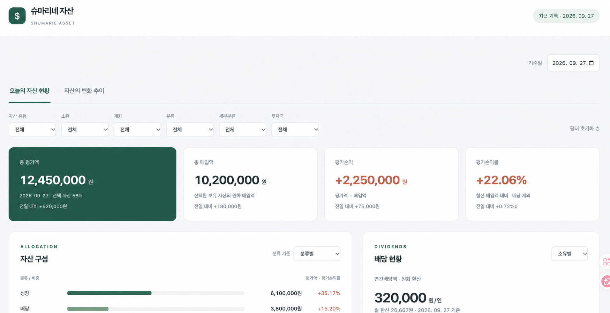

개인용도로 쓰는 대시보드들을 업데이트했다. Codex와 작업 했는데 매우 만족스러운 경험이었다. 나중에 기억을 돌아볼 겸 몇가지 두서 없이 정리해둔다. 

## Github Pages의 애증 

스태틱 페이지가 편하다. 일단 코딩이 쉬운 툴들이 많다. 관리도 싶다. 공공(?) 대시보드라면 상관 없지만, 인증이 필요한 경우라면? 깃헙 페이지스에 인증을 붙이는 일은 쉽지 않다. 정확히 말하면, 내 개인 용도로 쓸만한 적절한 수준의 인증을 못찾았을 뿐...  그래서 기존에는 html 페이지 자체에 암호를 거는 원시적이고 전혀 안전하지 않은 방식을 사용했다. 

이 고민을 코덱스와 상담하니, Cloudflare Pages로 배포선을 바꾸면 Cloudflare Access라는 서비스를 쓸 수 있다고 알려주었다. 어차피 세밀하게 권한 관리를 할 것은 아니고 해당 페이지를 볼 수 있는지 없는지만 제어하면 되니 용도에 잘 맞더라. 크리덴셜 부분이 항상 찜찜했는데 딱 필요한 수준의 적절한 해법을 찾았다. 

## 여전히 유용한 Google Sheet

개인 사용 용도로 이보다 유용한 데이터 관리 도구가 있을까? 흔히 대시보드를 만든다고 하면 데이터를 API에서 끌어와서 여차저차 작업하는 것이 멋지다고 생각할 것이다. 하지만 (개인 용도라면) 눈에 보이는 게 최고다. 이게 스프레드시트의 최고의 미덕이다. 

그런데 Google Sheet는 형식만 엑셀과 비슷할 뿐 내부는 꽤 다르다. 인터넷을 통해서 여러 정보를 끌어올 수 있는 다양한 함수 뿐 아니라 SQL 방식의 명령어를 바로 사용할 수 있게 만들어주는 명령어도 갖추고 있다. 만일 필요한 함수가 없다면 클로드, Codex, Gemini에게 내가 필요한 함수를 만들어달라고 하면 되니 문제될 것이 무엇일까? 

예를 들어보자. 한동안 연간 배당 액수를 어떻게 잡을지가 고민이었다. 증권사 앱에 들어가면 알려주지만 개인별로 또 증권사 계좌별로 흩어져 있다. 더 중요한 대목은 종합과세와 분리과세 대상이 되는 배당을 구별해야 하는데 증권사 앱들은 이런걸 해주지 않는다. 이런 고민들을 AI와 상담한 뒤, 이렇게 의뢰해보자. 

>> Google Sheet에서 쓸 gs를 만들어.

## 리부트 (very simple and easy)

다음과 같은 순서로 너무 편리하게 진행했다. 필요한 것은 토큰 뿐이다. 

- 기존 대시보드의 github 로컬 폴더를 코딩 에이전트와 공유 
- 외부 서비스에 접근할 수 있는 필요한 권한 부여 
- 작업 지시 

중간에 설정이 필요하면 에이전트가 수행할 수 있는 경우는 알아서 수행하고 내 작업이 필요한 경우는 세부적인 지침을 알려주더라. 사람이 필요할까, 싶었다.

대시보드의 느낌 자체는 제너릭하다. 즉 인공지능이 만든 것 같다는 뜻. 둘만 볼 거라서 큰 관계 없다. 물론 액수는 바꿨다. 

