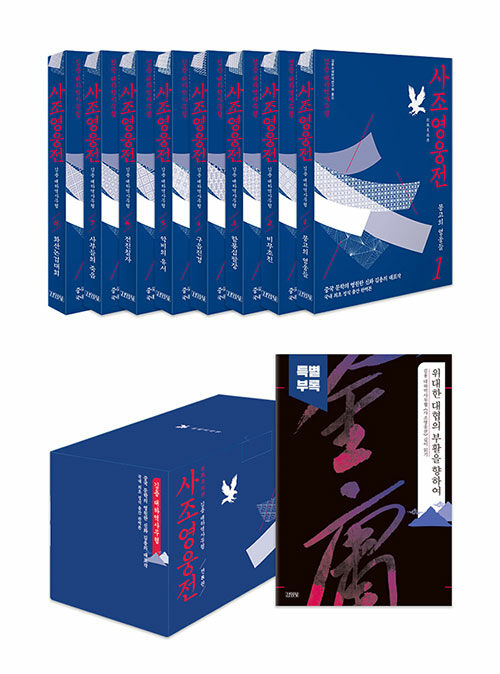
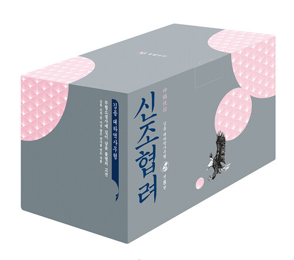

---
tags:
  - 국내도서
  - 소설/시/희곡
  - 무협소설
  - 외국무협소설
title: 사조삼부곡
subTitle: 8X3
author: 김용
publisher: 김영사
pubDate: 2020-07-08
category: 소설/시/희곡
myRate: 10
status: 읽는 중
startReadDate: 2026-08-28
finishReadDate: 2026-09-20
date: 2026-09-20
draft: false
---

## 전체적으로 

사족삼부곡은 몽골의 부흥에서 시작해서 명나라가 건국되기 직전까지의 시기를 다루고 있다. 한족의 대 오랑캐 항전(금나라, 명나라)을 아우르고 있다. 이런 중화적인 세계관의 통속 소설을 왜 중국 공산당이 금서화했는지는 잘 모르겠다. 문혁 이후 중국의 세계라는 시기의 특수성이 반영된 산물이 아닐까 막연하고 게으르게 추측해볼 뿐이다. 

## 뼈대를 만들다 

사조삼부곡의 뼈대는 단연 《사조영웅전》이다. 어린 시절 어려움을 당하는 주인공, 그를 돕는 협객들, 그리고 천하지존을 놓고 겨루는 무림의 영웅들(천하오절) 그리고 악당들의 요소들을 다 지니고 있다.

주인공 곽정의 캐릭터가 멋진지에 관해서는 솔직히 잘 모르겠다. 우직함을 미덕으로 내세우지만 뒷 시리즈의 주인공들인 양과나 장무기에 비하면 성격이 좀 약해 보인다. 대신 《사조영웅전》에서는 주변 캐릭터들이 더 돋보인다. 주인공의 스승 강남칠협(강남칠괴)나 천하오절 중 중신통 왕중양을 제외한 네 인물들의 성격은 매우 매력적이다. 동사와 서독, 남제와 북개는 각기 다른 방식으로 주인공들의 여정과 무공 그리고 성격 변화에 영향을 준다. 

개인적으로 가장 마음에 드는 캐릭터는 동사 황약사다. 사조삼부곡에 등장하는 인물 중에서 황약사 만큼의 르네상스인이 있을까? 무공, 서화, 건축, 시, 퉁소까지. 참으로 매력적인 인물이다. 게다가 세상의 평판에도 신경을 쓰지 않아서 본인의 성격과는 다른 동사(동쪽의 사악한 인물)이라는 평판까지 일부러 달고 있으니, 현대 지식인의 쿨함까지 갖추었다고 하겠다.

홍칠공은 어떤가? 항룡십팔장의 창시자이면서 미식가이자 대식가다. 직선적인 성격이지만, 어디 하나 치우침이 없다. 악당 서독 구양봉조차 구음진경을 익히고 말겠다는 그 집념, 하나 만큼은 높이 사야 할 것이다. 그 집념 덕에 잘못된 구음진경으로도 스스로 최고의 무공에 도달할 수 있었다. 

## 남자 주인공으로는 가장 매력적인 양과 

곽정과 대당을 이루는 존재인 양강이 비무초친을 통해 만난 목염자 사이에 태어는 양과는 이름(과)부터 아버지의 원죄를 물려 받았다. 삼부곡의 주인공들이 모두 어린 시절이 불우하지만, 불행이 우울과 결합된 유일한 존재는 양과다. 

양부 구양봉의 합마공을 이어 받았고, 신조에게서 전수받은 독고구검은 독보적인 경지다. 그 우울함과 결합해 발산하는 기이한 무공은 무한한 잠재력을 지니고 있다. 아버지를 이어 받은 악한 성정과 불우한 어린 시절이 만든 심리적 왜곡 또한 곽정과 대조적이다. 하지만 어떤 선을 넘지 않는다는 점에서는 역시 김용의 주인공이다. 나는 세 남주인공 중에서 양과가 제일 마음에 들더라. 

## 세련된 소설적 장치 

삼부곡 중에서 소설적 장치로 가장 세련된 것은 《의천도룡기》이다. 모든 무림인들의 관심을 끄는 도룡도와 의천검이 잃어버린 편지 같은 역할을 잘 수행한다. 이전에도 구음진경이 비슷한 역할을 수행했지만, 의천검과 도룡도로 형상화된 점과 몇몇 고수 뿐 아니라 중원의 떠들석한 화제가 된다는 점에서 보다 효과적인 장치인 셈이다. 

삼부곡의 남주 중에서 제일 불행한 존재가 장무기다. 하지만 그 불행 만큼 뛰어난 무공을 얻게 되는 것도 장무기다. 구양진경, 건곤대나이 그리고 태극권법/검법까지 흡수가 그가 아마도 무공으로는 셋중 최고가 아닐까 싶다. 다만 여자 앞에서 제일 약해지고 갈대처럼 흔들리는 그다. 때로는 이게 너무나 답답할 지경인데 뒤로 갈수록 그런 경향이 강해지더라. 

## 여주 중에서는 단연 조민 

황용이 가장 인기가 높을지 모르겠지만, 나의 선택은 조민이다. 신조협려의 소용녀는 왠지 색깔이 약하고 황용은 지나치게 곽정에 매인 존재처럼 느껴진다. 몽고 황실의 공주이면서 동시에 모든 무림 세력을 위기로 몰아 넣는 조민이야말로 삼부곡 여성 캐릭터 중에서 가장 매력적인 캐릭터다. 

《의천도룡기》는 장무기 주변에 너무 많은 여성을 배치했다. 어느 정도까지는 흥미로운 장치로 기능했을지 모르지만, 마지막 대목에 오면 좀 피로해진다. 이 점에서 가장 적절하게 여주의 역할을 수행한 것은 황용이 맞긴 할 것이다. 황용의 매력은 《사조영웅전》보다는 오히려 《신조협려》에서 돋보인다. 삼부곡에서 모성애를 가장 온전하게 대변하는 인물이기도 하다. 

## 신문 연재물의 매력 

이제는 사라진 신문 연재 소설의 매력이라면 횟수를 때워야 햐는 데에서 오는 풍부한 에피소드다. 이런 고육책이 아마도 오늘날의 웹툰, 웹소설에는 남아 있으리라고 본다. 세밀한 장면 묘사, (어쩌면 불필요해보이는) 긴 사설 따위가 그것이다. 

사조삼부곡의 캐릭터들이 지닌 공통점이라면 강점과 약점을 두루 지니고 있다는 것이다. 오늘날의 장르 소설들이 먼치킨을 앞세우는 경향이 있다면 과거의 캐릭터들은 강함은 강함대로 결함은 결함대로 유지한다. 

곽정은 우직함과 좋은 인연으로 절세무공을 익히지만 그 특유의 아둔함을 어쩔 수 없었다. 이 아둔함을 보완하는 것이 황용이다. 양과는 타고난 성정이 바르지 못하고 한을 지닌 존재지만 그 한을 무공으로 풀어내 누구도 범접할 수 없는 독고구검의 최고 경지를 이뤄냈다. 장무기는 어떤가? 타고난 오성으로 의술이든 무공이든 빠르게 익히고 수련할 수 있으나, 여인 앞에서는 바람 앞에 촛불이었다. 여자 캐릭터들도 마찬가지다. 황용은 지나치게 영악해서 너무 많은 앞수를 내다보다가 일을 그르치고, 소용녀는 특유의 히스테리를 어쩔 수 었었다. 주지약은 스승의 말이 족쇄가 되서 스스로를 파괴했다. 이런 게 김용 소설 캐릭터의 매력이 아닐까? 

## 반몽골 중화

금원 부흥기에서 원나라의 쇠락기(명의 부상)의 시기에 삼부곡이 놓여 있다. 한족의 중심성을 굳건하게 강조한다는 점에서 '정통' 중화소설이라고 해야 할 것이다. 앞서 말했듯이 이 책이 오랜기간 동안 중국에서 '금서'였다고 하는데, 이해할 수 없는 일이다. 다만 덩샤오핑 이후 김용 선생이 중국에서도 대문호로 추대받았으니 나름의 한풀이는 하지 않았을까 싶다. 

