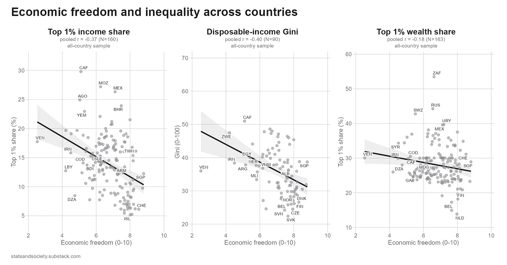
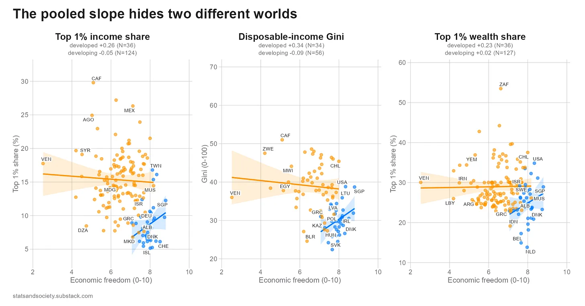
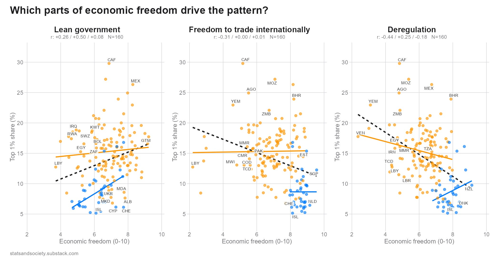

## 신자유주의, 유령 

이럴 때 쓰는 '유령'의 은유가 매우 진부하지만 역시 다시 찾을 수 밖에 없다. 신자유주의란 무엇인가? 이런 단어가 주는 매력은 그 애매모호함에 있다. 단어가 함축하는 개념이 모호할수록 오히려 가져다 쓰기 좋다. 그래야 자신이 원하는 것을 그 개념 안에 때가 박을 수 있기 때문이리라. 

1980년대부터 시작해서 WTO 창설을 통한 절정에 달했던 세계 자유무역 체제의 일정한 완성과 작동(아마도 대략 2008 GFC 직전까지가 아닐까 싶다)의 시기가 신자유주의가 회자되는 시기일 것이다. 

## 신자유주의, 악의 쓰레기 봉투 

많은 비판자들이 신자유주의를 해당 시기 발생했던 악의 쓰레기 통으로 취급한다. 신자유주의에 관한 가장 체계적인 비판자인 퀸 슬로보디언이 이에 근접할 것이다. 저 시기에 발생했던 악덕의 많은 부분은 신자유주의적인 발상, 즉 시장 우선 주의에서 비롯된 것이다. 저 시기에 발생했던 나쁜 일(불평등의 증가, 범죄의 증가, 생활고 등등)이 있다면 그것은 신자유주의의 탓이다. 

매우 간단한 해결책이지만, 동시에 아무 것도 해결하지 않은 것이다. 개념을 예리하게 사용하지 않고 전가의 보도처럼 휘두르면 사실상 아무 것도 베지 못할 뿐이다. 

## 신자유주의, 번영의 엔진 

많은 찬성자들은 저 시기 인류의 많은 진보가 시장을 통해서, 다시 말해 시장을 우선시하는 정책과 망딸리떼를 통해서 이루어졌다고 역설한다. 신자유주의가 왜 위대하냐고 묻거든 두 가지가 답하게 하라, 쯤 될까? 하나는 시장이라는 무기로 공산주의와 싸워서 마침내 승리하고 역사의 종언(?)을 찍었던 레이건 시대가 될 것이다. 공산주의가 붕괴되었다는 것은 반대로 시장이 옳았다는 것을 뜻한다. 두번째 사례는 WTO를 통해 세계 무역 체제에 편입되면서 눈부시게 날아 오른 중국이다. '민주주의'는 아니지만 거의 완벽하게 '시장경제'를 숭배한 그들은 21세기 세계경제의 역사에서 압도적인 승자로 기록되었다. 

하지만 이 시기에 가져온 번영 만으로 시장이 옳았다, 시장만이 답이라고 이야기할 수 있을까? 

## 신자유주의 흘겨보기 

이런 생산적이지 못한 논점을 깨는 것은 언제나 빗나간 시선이다. 두 개의 빗나간 시선을 소개한다. 물론 둘의 빗나감이 같은 위상에 있는 것은 아니다. 

### 밀라노비치; 자신의 몸을 먹어치운 신자유주의 

하나의 논점은 [밀라노비치](https://branko2f7.substack.com/p/how-the-virtues-of-neoliberal-globalization)의 논점이다. 신자유주의는 사회주의와의 대결에서 승부했고 이를 통해 기존이 손을 뻗지 못했던 지역까지 촉수를 미칠 수 있게 되었다. 그렇다면 그것이 가져온 결과는 무엇인가? 

시장과 여기서 허용되는 탐욕에 의해 모든 문제가 결국 해결될 것이라는 믿음은 글로벌 금융 위기(GFC)를 낳았다. 그리고 GFC를 통해 확인된 미국 사회과 경제의 취약성을 트럼프를 대통령으로 밀어올렸다. 그 이후 세계 정치의 풍경에서 이른바 '포퓰리즘'이 잠깐의 바람이 아닌 상수가 되었고, 이는 반대로 신자유주의의 최고의 전리품(촘촘하게 연결된 자본주의 세계 체제)를 흔드는 결과를 낳고 있다. 이젠 더 이상 체제 갈등 따위는 있을 수 없다고 선포한 "역사의 종언"이 오만했던 이유는 여기에 있는 것이다. 이 체제는 헌팅턴이 말한 "문명의 충돌"과 같은 외부적 충격으로 흔들리지 않았다. 밀라노비치에 따르면 스스로의 모순으로 내파해버렸다. 

신자유주의는 너무 성공했기 떄문에 붕괴중이다. 

### 티보 루타르(Tibor Rutar); 이념은 그렇게 강하지 않다 

루타르의 [논점](https://statsandsociety.substack.com/p/more-neoliberalism-less-inequality)은 보다 실증적이다. 만일 신자유주의가 모든 악의 근원이라면 그것이 심화될수록 악덕이 커지는 경향이 나타나야 할 것이다. 그런데 현실은 오히려 반대이다. 총량적으로 보면 경제적 자유의 정도의 부의 집중인 반비례 한다. 

여기서 선진국과 개도국을 구별해보는 것이 의미가 있을 것이다. 

개도국에서는 경제적 자유의 정도와 불평등이 거의 관찰되지 않는 반면 선진국에서는 어느 정도는 그런 경향성이 존재한다. 

이번에는 경제적 자유를 구성하는 부문에 따라서 나눠보자. 신자유주의의 모습을 가장 대변하는 세가지는 작은 정부, 무역의 자유 그리고 탈규제일 것이다. 

위 그림들이 이야기해주는 메시지는 명확하다. 어떤 이념적 단일성을 지닌 신자유주의가 존재해서 이런 녀석이 불평등이라는 악을 가져온다고 보기는 힘들다는 것이다. 더 들여다봐야 하고 쪼개서 봐야 한다. 