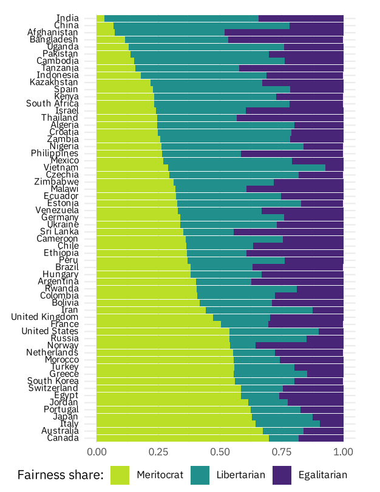

가끔 "중국은 사회주의 사회인데... 우리보다 더 자본주의적이야"라고 말하는 사람들을 본다. 속으로 그들에게 '생각하시는 자본주의란 무엇인가요'라고 묻고 싶을 때가 있다. 관련해서 흥미로운 연구를 접했다. 

세계인을 대상으로 한 방대한 실험 연구이다. 여기서 가른 불평등에 관한 사람들의 규범적 견해는 세가지이다. 

|**견해**|**능력·노력 기반 불평등 (Merit)**|**운 기반 불평등 (Luck)**|**불평등 수용 특성 요약**|
|---|---|---|---|
|**능력주의자 (Meritocrats)**|**수용** (공정함)|**거부** (불공정함)|정당한 노력과 능력에 따른 결과만 인정하고, 우연이나 운에 따른 격차는 배격함|
|**자유지상주의자 (Libertarians)**|**수용** (상관없음)|**수용** (상관없음)|발생 원인과 무관하게 불평등 자체를 문제 삼지 않으며 두 유형 모두 수용함|
|**평등주의자 (Egalitarians)**|**거부** (불공정함)|**거부** (불공정함)|발생 원인과 무관하게 결과의 불평등 자체를 인정하지 않으며 전면 거부함|

여기서 몇가지 논리적인 사고 실험이 가능하겠지만 그건 관두도록 하자. 흥미로운 사실만 적어둔다. 

자유지상주의자의 비율이 제일 높은 나라가 중국이었다. 한마디로 중국은 사회주의도 그렇다고 잘 정의된 룰셋을 지닌 자본주의도 아니다. 자본주의란 여러가지 얼굴을 하고 있고, '돈 벌고 싶으면 수단과 방법을 가리지 않고 돈을 벌 수 있는' 그런 곳은 아니다. 

한국은 어떨까? 이 조사에서 보면 대체로 선진국에 가깝고 능력주의적인 성향이 강하다. 그리고 당연하지만 유럽이나 북구 사회보다는 평등주의적 지향은 많이 약한 편이다. 

## reference 

Ingvild Almås, Alexander W Cappelen, Erik Ø Sørensen, Bertil Tungodden, FAIRNESS ACROSS THE WORLD, _The Quarterly Journal of Economics_, 2026;, qjag044, [https://doi.org/10.1093/qje/qjag044](https://doi.org/10.1093/qje/qjag044)

[Open: The_Morality_of_Inequality.pdf](/assets/904edf769cf51845ddecbd0bbd6eafd9_MD5.pdf)