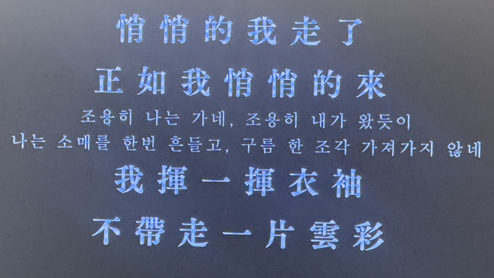

## 落日飛車

아마도 낙일비차(선셋롤러코스터)의 공연에서 본 대만 시인의 시구가 발단이지 않았을까 싶다. 물론 현재 상황에 비추어 이렇게 하지 않을까, 라는 예감은 있었지만 이 시구를 접하고 그 예감은 거의 확신이 되었다. 

이들의 앨범 quit quietly는 시구에서 온 말이다. 대만의 시인 쉬즈모(徐志摩)의 <재별강교 (再別康橋)> 구절이며, 강교는 영국 케임브릿지의 음차 표기라고 한다. 

## 회사란 어쩌면, 나의 강교

1931년까지 살았던 시인에게 케임브릿지는 어떤 의미였을까? 그리워하지만 아마도 조용히 떠나야 할 무엇일지도 모르겠다. 나에게 회사도 비슷할 듯 싶다. 여기에서 남길 것도 없고 미련을 둘 것도 없다. 왔을 때 조용히 왔듯이, 갈 때도 구름 한 조작 가져가지 않을 것이다. 

