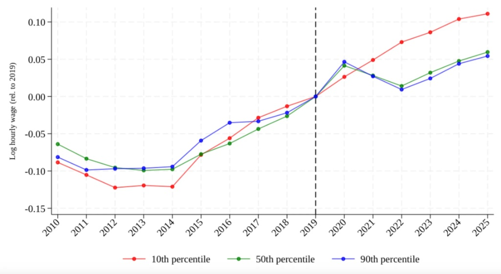

## tl;dr 

로그 차분, 즉 로그를  뺀 값은 백분율 변화의 근사치가 된다. 

## 도출 

기준 시점의 임금을 $w_0$, 비교 시점의 임금을 $w_1$이라 하고, 임금의 실제 변화율을 $g$라고 둔다.

$$g = \frac{w_1 - w_0}{w_0}$$

이를 $w_1$에 대해 정리하면 다음과 같다.

$$w_1 = w_0(1 + g)$$

그래프의 Y축에 표시된 로그 차분(비교 시점 로그값 - 기준 시점 로그값)에 위 식을 대입한다.

$$\ln(w_1) - \ln(w_0) = \ln\left(\frac{w_1}{w_0}\right) = \ln(1 + g)$$

즉, 로그 차분의 값은 정확히 $\ln(1 + g)$가 된다.

**2. 테일러 전개(근사)의 적용**

자연로그 함수 $\ln(1 + g)$는 $g$가 $0$에 가까울 때 테일러 급수(매클로린 급수)를 통해 다음과 같이 무한 다항식으로 전개된다.

$$\ln(1 + g) = g - \frac{g^2}{2} + \frac{g^3}{3} - \frac{g^4}{4} + \cdots$$

변화율 $g$가 충분히 작은 값(예: $0.1$ 이하)일 경우, $g^2, g^3$ 등의 고차항은 $0$에 극도로 수렴하여 무시할 수 있을 만큼 작아진다.

- $g = 0.05$일 때:
    
    - $g = 0.05$
        
    - $\frac{g^2}{2} = \frac{0.0025}{2} = 0.00125$ (오차 수준 미미)
        

따라서 2차 이상의 고차항을 제거하면 다음의 근사식이 성립한다.

$$\ln(1 + g) \approx g$$

결과적으로 아래와 같은 등식이 성립한다.

$$\ln(w_1) - \ln(w_0) \approx \frac{w_1 - w_0}{w_0} = g$$

대략 $g$가 0.1 이하에서는 오차를 무시해도 좋을 정도로 작다. 물론 무시해도 좋은 정도는 무엇을 다루느냐에 따라서 다르겠지만, 경제학의 성장률 혹은 금융의 이자율 같이 빠른 어름이 중요한 맥락이라면 큰 문제가 없다. 

## 예시 

위 그림은 아린 듀베(Arindrajit Dube) 교수의 연구에서 가져온 것이다. 그래프의 세로 축은 시간 당 임금의 로그 값이다. 

- 2019년이 0으로 정규화
- 2025년의 10th의 수준은 대략 0.11이므로 2019년에서 2025년의 시간 임금의 변화율은 11% 정도라고 추산 

로그 그림이 편리한 것은 해당 그림에서 선의 기울기(무리한 경우가 아니라면 회귀선)가 곧 성장률을 의미하기 때문이다. 로그가 세로 축을 때 이 기울기를 비교하면 어디의 변화율이 더 컸는지 쉽게 찾을 수 있다. 

