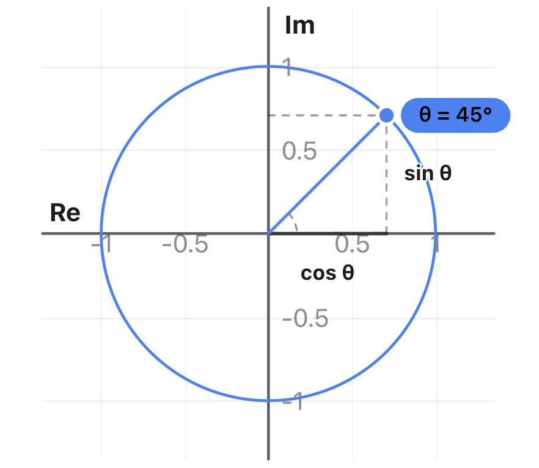

오일러 수, $e$, 에 관해서 한번 사적으로 쭉 정리해보려고 한다. 사적인 정리이며 어떤 공익적 목적도 없다! 

## 정의 1: $e$

자연상수 $e$는 대략 $2.71828...$ 값을 가지는 무리수이다. 이 값은 복리 이자 계산에서 처음 등장했다.  

- 연 100% 단리: 원금 1원에 1년 뒤 이자 1원이 붙어 2원이 된다.  
- 반기 복리 (6개월마다 50%): 6개월 뒤 1.5원이 되고, 그 1.5원에 다시 50%가 붙어 1년 뒤 $(1 + 0.5)^2 = 2.25$   
- 매일 복리 (365일로 분할)는 $(1 + \frac{1}{365})^{365} \approx 2.7145$

이자 지급 주기를 1초를 넘어 '찰나의 순간(연속)'으로 무한히 쪼개면 원금은 무한대로 발산하지 않고 특정 상수에 수렴한다. 이 극한값이 바로 $e$이다.  

$$
e = \lim_{n \to \infty} \left(1 + \frac{1}{n}\right)^n \approx 2.71828
$$

즉, $e$는 '성장률이 100%일 때, 쉬지 않고 매 순간 복리로 증식하면 1단위 시간 뒤에 도달하는 최대 배율'을 뜻한다.

## 정의 2: $e^x$

$$
e^x \equiv \lim_{n \to \infty} \left(1 + \frac{x}{n}\right)^n
$$

$e^x$의 가장 큰 대수적인 특징은 $x$로 미분한 값이 그 자신이라는 것이다. 즉, 

$$
\frac{d}{dx}e^x = e^x
$$

이 말의 의미를 조금 더 풀어보자. $x$에 대한 $e^x$의 기울기를 의미한다. x를 어떻게 정의하는지에 따라서 다르겠지만 순간 증가량이라고 봐도 좋고 변화량이라고 봐도 좋을 것이다. 이 변화량이 현재 자신의 값과 일치한다. 즉, 현재 값이 크면 클수록 늘어나는 양도 그만큼 커진다. 이른바 '복리의 원리'라는 걸로 이해하면 되겠다. 매순간 이러한 성장/변화가 발생한다.  

##  $e^{rt}$의 활용 

좀 더 금융의 맥락에서 살펴보자. 

연이율 $r$을 1년에 $n$번 나누어 복리로 지급하는 경우, $t$년 뒤의 배율은 다음과 같다:  

$$
\text{multiple} = \left(1 + \frac{r}{n}\right)^{nt}
$$
  
이자 지급 주기를 찰나의 순간($n \to \infty$)으로 무한히 쪼개면:  

$$
\lim_{n \to \infty} \left(1 + \frac{r}{n}\right)^{nt} = \lim_{n \to \infty} \left[ \left(1 + \frac{r}{n}\right)^{\frac{n}{r}} \right]^{rt} = e^{rt}
$$

  
이로 인해 불연속적인 단계(1년, 1달, 1일 단위)가 사라지고, 매 순간 매끄럽게 불어나는 연속 성장 모델이 완성된다.

## 응용 

### 72 법칙

이른바 72의 법칙이란 것이 있다. 성장률이 아주 높지 않을 때 어떤 초기 값이 2배가 되는 데 걸리는 시간을 얻는 어림 셈법이다. 즉, 만일 6%로 경제성장을 한다면 경제가 2배 되는데 걸리는 시간은 대략 12년이다. 이건 어디에서 나왔을까? 원금이 정확히 2배($2P$)가 되는 조건을 세우면 다음과 같다.  
  
$$
P(1 + r)^t = 2P \implies (1 + r)^t = 2
$$

양변에 자연로그($\ln$)를 취한다.  

$\ln\left((1 + r)^t\right) = \ln(2)$

$$t \cdot \ln(1 + r) = \ln(2)$$
  
이를 기간 $t$에 관해 정리하면 정확한 해가 도출된다.  

$$t = \frac{\ln(2)}{\ln(1 + r)}$$

두 개의 근사값을 취한다. 

만일 $r$이 충분히 작다면 테일러 전개에 의해서 $\ln(1+r) \approx r$이라고 둘 수 있다. 그러면, 

$$
t r \approx \ln(2) \approx 0.693
$$

$R=100r$이라고 할 때  

$$
t R = 69.3 \approx 72
$$

## 오일러 정리 

아마도 $e$를 응용하는 가장 흥미로운 사례는 오일러 정리일 것이다. 직관적으로는 이렇다. $e^{ix}$는 좌표평면에서 보면 $y$으로 움직이게 된다. 만일 $ㅌx=0$이면 $e^0=1$이 되다. 반면, $e^{i\pi/2}$는 어떨까? 여기서 $x$는 라디안으로 이해하면 된다. 복소평면에서 90도 회전한 것으로 표현된다. 왜 허수는 복수평면 위에서의 회전으로 잘 표현이 될까? 허수의 속성 때문이다. 즉, 

$$ 
1 \xrightarrow{\times i} i \xrightarrow{\times i} -1 \xrightarrow{\times i} -i \xrightarrow{\times i} 1 
$$

$x$가 라디안이 되는 이유도 분명하다. 복소평면에서 $i$가 되기 위해서는 반시계방향으로 90도, 즉 $\pi$ 만큼 회전해야 한다. 이렇다면 이러한 회전을 연속해서 표현하려면? 여기에 딱 적합한 것이 바로 오일러 공식이다. 

$e^x$는 **아주 작은 변화를 계속 누적한 결과**로 볼 수 있다.

$$
e^x = \lim_{n\to\infty} \left(1+\frac{x}{n}\right)^n
$$

여기에 $x=i\theta$를 넣으면

$$
e^{i\theta} = \lim_{n\to\infty} \left(1+\frac{i\theta}{n}\right)^n
$$

이다. 각 단계의

$$ 
1+\frac{i\theta}{n}
$$

를 복소평면에서 보면 **아주 조금 위쪽으로 방향을 트는 것**과 비슷하다. 그리고 이는 오일러 공식과 같은 삼각함수의 해석을 지닌다. 

$$ 
e^{i\theta}=\cos(\theta)+i\sin(\theta) 
$$

혁명적인 공식이 아닌가? 삼각함수를 대수적으로 완벽하게 연결한다. 이제 삼각함수를 미분할 수 있게 된 것이다. 오일러 공식에 \(\theta=\pi\)를 넣으면 오일러 항등식이 나온다. 수학의 가장 유명한 초월수 오일러수와 파이가 등장하고 1, 0이 모두 등장하는 항등식이다. 

$$ 
e^{i\pi}+1=0 $$

드무아브르 공식 (De Moivre's formula)도 그대로 도출된다. 

$$ 
(\cos\theta+i\sin\theta)^n = \cos(n\theta)+i\sin(n\theta) 
$$

오일러 공식을 이용하면

$$
(e^{i \theta})^n=e^{in \theta}
$$

## 이해 방식 

### $e^x$에서 $x$는 뭐지? 

내가 가장 혼동되었던 것은 이 대목이다. $e$에서 생각해보자. 100%를 주는 상황이다. $e$의 지수는 1이다. 이 100%라는 증가량이 연속적으로 가해질 때 결국 어느 정도의 액수가 될 것인지의 문제다. 즉, 오일러 수의 지수는 어떤 대상에 가해지는(투입되는) 변화/힘의 명시적인 크기를 의미한다. 

혼동되었던 대목은 이동 거리, 누적 성장량과 같은 표현이다. 이동 거리를 보면 어떤 물체가 현재 상태에서 얼마큼 이동했는지를 보여주어야 할 것이 아닌가? $e$를 통해 측정하는 변화는 "단순 누적 노력($rt$) 뒤에 '복리(피드백)'라는 가속 엔진이 붙었을 때, 시스템이 실제로 변화한 최종 결과치"로 이해하는 것이 좋다.

