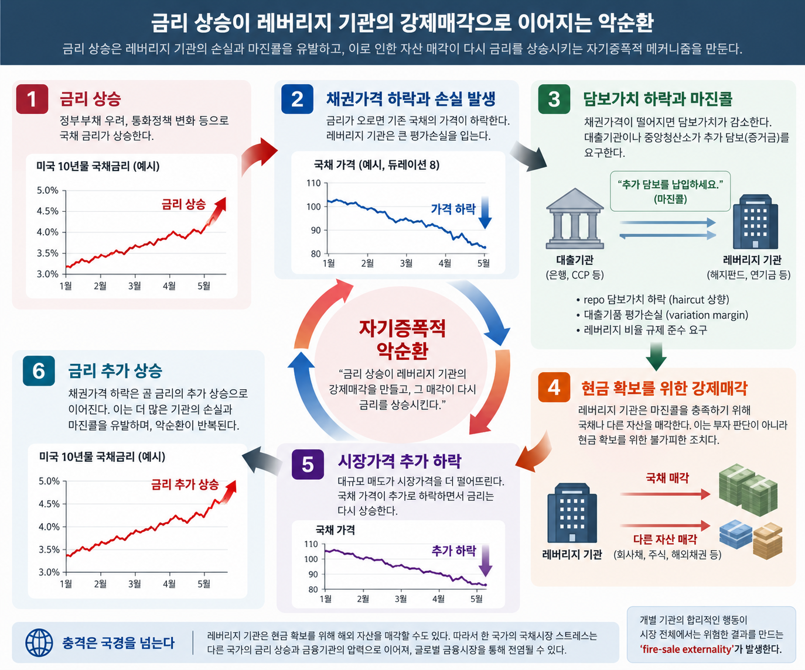

# 금리가 오르면 왜 레버리지 기관이 위험해지는가

금리가 급등하면 채권을 많이 보유한 금융기관이 손실을 본다. 금리가 오르면 기존 채권의 가격이 떨어지기 때문이다. 여기까지는 별로 복잡한 이야기가 아니다. 그런데 금융시장의 불안을 이해하려면 한 걸음 더 나아가야 한다. 채권가격이 떨어져 금융기관이 손실을 보는 것과 금융시스템 전체가 불안해지는 것은 서로 다른 문제이기 때문이다.

그렇다면 개별 금융기관의 손실은 어떻게 시장 전체의 충격으로 확대되는가. 그리고 국채시장에서 시작된 충격은 왜 회사채나 주식, 심지어 다른 나라의 금융시장으로까지 번져가는가.

이 과정의 중심에 **레버리지(leverage)**가 있다.

## 레버리지는 손실을 확대한다

먼저 아주 단순한 금융기관을 생각해보자. 자기자본 10을 가진 기관이 90을 빌려 100만큼의 국채를 보유하고 있다고 하자. 자산 100을 자기자본 10으로 보유하고 있으므로 레버리지는 10배다.

이 상태에서 금리가 상승해 국채가격이 5% 떨어지면 무슨 일이 생길까.

||처음|국채가격 5% 하락 후|
|---|---|---|
|국채|100|95|
|부채|90|90|
|자기자본|10|5|
|레버리지|10배|19배|

자산가치는 100에서 95로 5%밖에 줄어들지 않았다. 하지만 부채 90은 그대로이므로 손실 5는 모두 자기자본이 부담한다. 그 결과 자기자본은 10에서 5로 절반이 된다. **자산가격은 5% 하락했지만 자기자본은 50% 감소한 것이다.**

레버리지의 기본적인 속성이 바로 이것이다. 대략적으로 생각하면 자산가격의 변화가 자기자본에 미치는 영향은 레버리지 배수만큼 확대된다.

$$
\frac{\Delta E}{E}\approx L\frac{\Delta A}{A}  
$$

따라서 10배의 레버리지를 사용하는 기관이라면 자산가격 1%의 움직임이 자기자본에는 약 10%의 변화로 나타날 수 있다. 자산가격이 상승할 때는 이것이 높은 자기자본수익률을 만들어주는 원천이지만, 가격이 하락하기 시작하면 같은 메커니즘이 정확히 반대 방향으로 작동한다.

채권에서는 여기에 금리위험까지 더해진다. 채권가격은 금리와 반대 방향으로 움직이며, 그 민감도는 듀레이션(duration)에 의해 크게 좌우된다. 대략

$$
\frac{\Delta P}{P}\approx-D_{\mathrm{mod}}\Delta y  
$$

로 생각할 수 있다. 수정듀레이션이 8인 채권이라면 금리가 1%포인트 상승할 때 채권가격은 대략 8% 하락한다. 장기채를 높은 레버리지로 보유한 기관이라면 이 정도의 금리 변화만으로도 자기자본에 상당한 손실이 발생할 수 있다.

그러나 이것만으로 금융위기가 발생하는 것은 아니다. **레버리지의 진짜 위험은 손실의 크기보다 그 손실이 기관의 행동을 강제한다는 데 있다.**

## 평가손실이 현금 부족으로 바뀌는 순간

레버리지를 활용하는 금융기관은 단순히 돈을 빌려 채권을 사는 데 그치지 않는다. 국채를 담보로 repo 시장에서 자금을 조달하기도 하고, 금리선물이나 금리스왑 같은 파생상품을 이용해 포지션을 구축하기도 한다. 이 경우 채권가격의 하락은 장부상의 평가손실에 머물지 않고 곧바로 **자금조달 압력(funding pressure)**으로 이어질 수 있다.

예를 들어 100의 가치가 있던 국채를 담보로 돈을 빌렸는데 국채가격이 90으로 떨어졌다고 하자. 돈을 빌려준 쪽에서는 자신이 확보하고 있는 담보의 가치가 줄어든 셈이다. 따라서 추가 담보를 요구하거나, haircut을 높이거나, 대출 규모 자체를 줄이려 할 수 있다. 파생상품을 사용하고 있다면 상황은 더 직접적이다. 금리 변화로 포지션에서 평가손실이 발생하는 순간 거래상대방이나 중앙청산소가 variation margin을 요구할 수 있다.

이때 중요한 차이가 하나 생긴다. 자산가격 하락으로 인한 평가손실은 장부 위의 숫자일 수 있지만, **마진콜은 당장 현금을 내놓으라는 요구**다.

기관이 충분한 현금을 보유하고 있다면 이를 감당할 수 있다. 하지만 높은 레버리지를 사용하는 기관일수록 일반적으로 자본과 유동성의 여유가 작다. 결국 현금을 마련하려면 보유자산을 팔아야 한다. 국채가격이 지나치게 떨어졌다고 판단하더라도, 며칠 뒤에는 가격이 회복될 것이라고 확신하더라도 오늘 들어온 마진콜을 충족하지 못하면 포지션을 유지할 수 없다.

여기서 투자자의 선택은 크게 달라진다. 평상시라면 “현재 가격에서 이 자산을 파는 것이 합리적인가”를 판단하지만, 유동성 압박을 받는 순간 질문은 “오늘 현금을 얼마나 마련해야 하는가”로 바뀐다. **가격에 대한 판단보다 balance-sheet constraint가 행동을 결정하기 시작하는 것이다.**

그래서 금융불안의 국면에서는 solvency보다 liquidity가 먼저 문제가 되기도 한다. 장기적으로 충분한 가치가 있는 자산을 보유하고 있어도 단기적인 현금 수요를 감당하지 못하면 그 자산을 헐값에 팔 수밖에 없다.

## 강제매각이 다시 금리를 올린다

여기까지가 개별 금융기관의 문제라면, 이제부터는 시장 전체의 문제가 시작된다.

처음에는 정부의 재정상황에 대한 우려든 통화정책 전망의 변화든 어떤 외부적인 이유로 국채금리가 상승했다고 하자. 금리가 오르면 국채가격이 떨어지고, 높은 레버리지를 사용하던 기관의 자기자본이 감소한다. 동시에 담보가치가 떨어지고 파생상품에서는 마진콜이 발생한다. 현금이 부족해진 기관은 결국 국채를 매각한다.

그런데 한 기관이 국채를 매각하는 것으로 끝나지 않는다. 비슷한 전략을 사용하던 기관들이 동시에 같은 압력을 받고 있다면 모두가 비슷한 시점에 국채를 팔기 시작한다. 매물이 쏟아지면 국채가격은 더 떨어지고, 가격이 더 떨어지면 국채금리는 다시 상승한다.

그러면 처음의 충격을 가까스로 견디고 있던 다른 기관에서도 추가 손실과 추가 마진콜이 발생한다. 이들도 다시 국채를 팔아야 한다.

결국 다음과 같은 순환이 만들어진다.

**금리 상승 → 국채가격 하락 → 레버리지 기관의 손실 → 담보 부족과 마진콜 → 강제매각 → 국채가격 추가 하락 → 금리 추가 상승**

중요한 것은 최초의 금리 상승과 그 이후의 금리 상승의 성격이 다르다는 점이다. 최초의 금리 상승은 재정정책이나 통화정책 같은 외부 충격에서 시작했을 수 있다. 그러나 어느 순간부터는 **금융기관의 balance sheet가 시장가격을 움직이기 시작한다.**

금리 상승이 금융기관의 재무상태를 악화시키고, 금융기관이 자신의 재무상태를 방어하기 위해 취한 행동이 다시 금리를 상승시키는 **자기증폭적 피드백(self-reinforcing feedback)**이 형성되는 것이다.

## 왜 국채시장의 충격이 다른 시장으로 번지는가

문제는 여기서 끝나지 않는다. 마진콜을 받은 금융기관이 반드시 국채를 팔아야 하는 것은 아니기 때문이다.

기관에 필요한 것은 국채 매각 자체가 아니라 **현금**이다. 따라서 시장이 불안할수록 오히려 가격이 많이 떨어진 자산보다 쉽게 팔 수 있는 자산부터 처분할 가능성이 있다. 회사채를 팔 수도 있고, 주식을 팔 수도 있으며, 해외에서 보유하고 있던 채권을 매각할 수도 있다.

이렇게 되면 처음에는 국채시장의 금리 상승이었던 충격이 전혀 다른 자산시장으로 이동한다. 미국 국채에서 발생한 손실을 메우기 위해 회사채를 매각하면 회사채 스프레드가 확대되고, 주식을 매각하면 주가가 하락한다. 해외 채권을 팔면 그 나라의 채권가격이 떨어지고 금리가 올라간다.

특히 금융기관의 자산과 부채가 세계적으로 연결되어 있는 오늘날에는 이러한 과정이 국경에서 멈추지 않는다. 한 나라에서 발생한 손실 때문에 글로벌 금융기관이 다른 나라의 자산을 처분하고, 그 매각이 현지 금융기관의 balance sheet를 악화시키면서 새로운 매각을 불러올 수 있다.

따라서 금융시장의 **contagion**, 즉 전염은 반드시 한 기관의 부도가 다른 기관의 부도를 직접 초래하는 방식으로만 일어나는 것이 아니다. 같은 자산을 보유하고 있다는 사실, 같은 자금조달 시장에 의존하고 있다는 사실, 그리고 현금을 확보하기 위해 서로 다른 시장의 자산을 매각해야 한다는 사실만으로도 충격은 시장과 국경을 넘어 전파될 수 있다.

## 2022년 영국 LDI 사태가 보여준 것

2022년 영국의 LDI(Liability-Driven Investment) 사태는 이러한 메커니즘을 현실에서 잘 보여준 사례다.

영국의 많은 확정급여형 연기금은 장기간에 걸쳐 연금을 지급해야 한다. 이들의 부채가 장기금리에 매우 민감하기 때문에 연기금들은 장기 국채와 금리 파생상품을 활용하는 LDI 전략으로 금리위험을 관리해왔다. 이 과정에서 파생상품과 repo를 이용한 레버리지가 활용됐다.

평상시에는 이 구조가 특별한 문제를 일으키지 않는다. 그러나 2022년 9월 영국 국채금리가 매우 빠르게 상승하면서 상황이 달라졌다. 금리 파생상품 포지션에서 대규모 담보 요구가 발생했고, LDI 펀드와 연기금은 짧은 시간 안에 현금을 마련해야 했다.

현금을 확보하는 가장 직접적인 방법 가운데 하나는 보유하고 있던 영국 국채를 파는 것이었다. 그런데 여러 기관이 동시에 국채를 팔면서 국채가격이 더 하락했고, 그 결과 금리는 더 상승했다. 금리가 더 오르자 파생상품에서 다시 추가적인 담보 요구가 발생했고, 이를 충족하기 위해 다시 자산을 팔아야 했다.

처음에는 금리 상승 때문에 발생한 손실이 어느 순간부터 **금리 상승 → 마진콜 → 국채 매각 → 금리 추가 상승 → 더 큰 마진콜**이라는 순환으로 바뀐 것이다.

결국 영란은행은 시장 기능을 안정시키기 위해 장기 국채를 일시적으로 매입했다. 중요한 것은 특정 연기금의 투자 손실을 보전하는 것이 아니라, 강제매각과 가격하락이 서로를 증폭시키는 과정 자체를 끊는 것이었다.

## 레버리지의 진짜 위험

그래서 레버리지의 위험을 단순히 “빌린 돈으로 투자하면 손실이 커진다”라고 설명하는 것은 충분하지 않다.

물론 그것도 맞다. 레버리지가 높으면 작은 자산가격 변화가 자기자본의 큰 변화로 확대된다. 하지만 금융시스템의 관점에서 더 중요한 문제는 그 다음이다. **레버리지는 자산가격 하락을 강제매각으로 전환한다.**

자산가격이 떨어지면 자기자본이 감소하고 담보가치도 하락한다. 그러면 금융기관은 레버리지를 줄이거나 추가 증거금을 내야 하고, 이를 위해 자산을 매각한다. 그 매각이 시장가격을 더 떨어뜨리면서 처음에는 아무 문제가 없었던 다른 기관의 balance sheet까지 악화시킨다.

각 기관의 관점에서 보면 이러한 행동은 합리적이다. 마진콜을 받았으니 현금을 마련해야 하고, 위험이 커졌으니 레버리지를 줄여야 한다. 그러나 모든 기관이 동시에 같은 행동을 하면 개별적으로는 합리적인 행동이 시장 전체의 가격을 무너뜨릴 수 있다.

이것이 **fire-sale externality**다.

한 기관이 자산을 팔 때 그 기관은 자신의 매도가 시장가격을 낮추고, 그 가격하락이 다른 기관의 balance sheet를 악화시켜 또 다른 매각을 불러오는 효과까지 고려하지 않는다. 개별 기관의 위험관리가 금융시스템 전체에서는 오히려 위험을 증폭시키는 역설이 발생한다.

## 그래서 국채시장의 스트레스가 중요하다

EconoFact의 「Federal Debt and the Risk of a Fiscal Crisis」가 이 문제를 강조하는 이유도 여기에 있다. 국채는 단순히 정부가 발행한 채권 가운데 하나가 아니다. 특히 미국 국채는 세계 금융시장에서 대표적인 안전자산인 동시에 repo와 파생상품 시장에서 핵심 담보로 사용된다.

따라서 국채금리가 급격하게 상승하는 상황을 단순히 “국채 투자자가 손실을 본다”는 문제로 이해해서는 충분하지 않다. 국채가격의 하락은 금융기관의 자기자본을 감소시키는 동시에 담보가치를 떨어뜨리고, 이를 기반으로 형성된 레버리지와 자금조달 구조 전체에 압력을 가할 수 있다.

그리고 어느 임계점을 지나면 인과관계의 방향도 달라진다. 처음에는 금리가 금융기관의 balance sheet를 움직였지만, 이후에는 금융기관의 balance sheet가 다시 금리를 움직인다.

결국 정부부채와 금융안정의 관계를 생각할 때 중요한 것은 정부부채의 절대적인 규모만이 아니다. **국채금리의 급격한 변화가 레버리지 금융기관의 balance sheet와 funding constraint를 통해 어떤 피드백을 만들어내는가**를 함께 봐야 한다.

레버리지의 가장 위험한 특징은 단순히 손실을 확대한다는 데 있지 않다.

**가격 하락을 강제매각으로 바꾸고, 그 강제매각이 다시 가격을 떨어뜨리는 자기증폭적 메커니즘을 만들어낸다는 데 있다.**

### 참고

EconoFact, _Federal Debt and the Risk of a Fiscal Crisis_  
[https://econofact.org/explainer/federal-debt-and-the-risk-of-a-fiscal-crisis](https://econofact.org/explainer/federal-debt-and-the-risk-of-a-fiscal-crisis)

